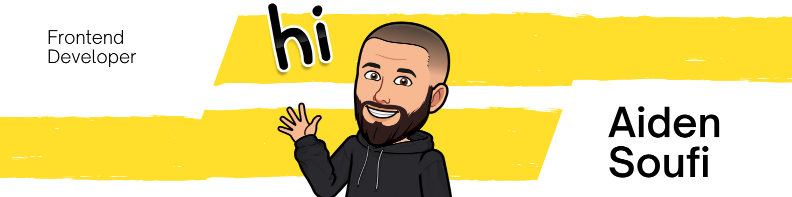

👋🌍  Iam a highly motivated growing junior front-end developer who recently graduated (magna cum laude) from [Artevelde university of applied sciences](https://www.artevelde-uas.be/programmes/associate-degree/computer-programming) Gent Belgium.
## Contact Information

:house: Heusden 9070, East Flanders, Belgium

:email: soufi.aiden@gmail.com

:website: https://aiden-soufi.netlify.app/ 

## Social

## Skills

## Education

- Associate's degree in computer programming [Artevelde university of applied sciences](https://www.artevelde-uas.be/programmes/associate-degree/computer-programming) Gent Belgium
- New multimedia technologies [Howest](https://mct.be/) Kortrijk Belgium
- Master degree in dentistery from [Kharkiv National Medical University](http://www.knmu.kharkov.ua/index.php?lang=en) in Ukraine
## Experience

### SQLI Digital Experience

Internship as Front-End developer\
Feb 2022 - May 2022 · 4 mos
## Languages

English | Dutch | Ukrainian | Russian

## Interests

Traveling | Video games | Netflix | Reading
## Github stats

  
